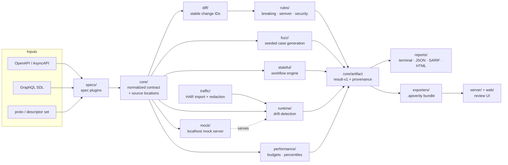

# api-verity-lab

<!-- badges -->
[](https://github.com/webdevsamran/api-verity-lab/actions/workflows/ci.yml)
[](https://github.com/webdevsamran/api-verity-lab/actions/workflows/codeql.yml)
[](https://github.com/webdevsamran/api-verity-lab/releases)
[](https://github.com/webdevsamran/api-verity-lab/blob/main/LICENSE)
[](pyproject.toml)
[](pyproject.toml)
<!-- /badges -->

**Unified API contract governance, breaking-change analysis, schema-driven
testing, runtime drift detection, traffic replay and performance regression
for OpenAPI, GraphQL and gRPC.**

One modular, local-first platform that connects spec diffing, fuzzing,
drift detection, mocking and performance gates through **one data model,
one CLI, one result format, one plugin system and one frontend**.

> Original creator / founder / lead maintainer: **[@webdevsamran](https://github.com/webdevsamran)**
>
> ⚠️ Example/demo runs in this repository are clearly labeled synthetic data.
> The tool only ever sends traffic to base URLs you explicitly provide.

---

## The problem

Teams stitch together separate tools for spec diffing, contract testing,
fuzzing, drift detection, mocking and performance budgets. Each has its own
result format, its own CI wiring and its own mental model — so findings never
compose: you can't ask "which endpoints are both under-tested *and* drifting?"

api-verity-lab answers thirteen questions from one place:

| Question | Command |
|---|---|
| What changed between API versions? | `apiverity diff old.yaml new.yaml` |
| Is it breaking, risky or safe? | `apiverity breaking` |
| Was semantic versioning respected? | `apiverity breaking --check-semver` |
| Does the running API match its contract? | `apiverity drift --base-url` |
| How often did real traffic disagree with it? | `apiverity drift --corpus traffic.har` |
| Can schema-derived edge cases break it? | `apiverity test` |
| Do multi-step workflows fail? | `apiverity workflow run` |
| Can sanitized traffic be replayed safely? | `apiverity replay` |
| Did latency/error rate regress? | `apiverity regression` |
| Which endpoints lack coverage? | `apiverity coverage` |
| Can CI block breaking changes before release? | GitHub Action (included) |
| Is a provider version safe to deploy? | `apiverity` server `/v1/can-i-deploy` |
| Who executes jobs inside our private network? | Workers pull via `POST /v1/jobs/claim` |

## 60-second quickstart

```bash
pip install api-verity-lab          # or: pip install -e ".[dev]" from a clone

# 1. Validate a contract
apiverity validate fixtures/apis/crud/openapi.yaml

# 2. Diff two versions and detect breaking changes
apiverity diff fixtures/apis/versioned/v1.yaml fixtures/apis/versioned/v2.yaml --json
apiverity breaking fixtures/apis/versioned/v1.yaml fixtures/apis/versioned/v2.yaml

# 3. Enforce semver policy
apiverity breaking fixtures/apis/versioned/v1.yaml fixtures/apis/versioned/v2.yaml \
    --old-version 1.2.0 --new-version 1.3.0 --check-semver

# 4. Spin up the deterministic mock and test against it
apiverity mock fixtures/apis/crud/openapi.yaml --port 8090 &
apiverity test fixtures/apis/crud/openapi.yaml --base-url http://127.0.0.1:8090

# 5. Run an authored workflow (create → get → update → delete)
apiverity workflow run fixtures/workflows/crud-lifecycle.yaml

# 6. Detect runtime drift
apiverity drift fixtures/apis/drift/openapi.yaml --base-url http://127.0.0.1:8090

# 7. Gate performance
apiverity baseline fixtures/apis/crud/openapi.yaml --base-url http://127.0.0.1:8090 -o baseline.json
apiverity regression fixtures/apis/crud/openapi.yaml --base-url http://127.0.0.1:8090 \
    --baseline baseline.json --policy "GET /users p95 <= 250ms"
```

Every command supports `--json`, stable exit codes (`0` ok, `1` findings at/above
threshold, `2` usage error, `3` target unreachable, `4` internal error).

## A diff example

<!-- capture:diff -->
```console
$ apiverity diff v1.yaml v2.yaml
tool: apiverity
command: diff
old_version: 1.2.0
new_version: 2.0.0
changes:
  [meta] CHG-OPERATION_REMOVED-92658ed2-1  operation 'DELETE /users/{id}' was removed
  [request] CHG-PARAMETER_REQUIREDNESS-ca0e1629-1  parameter 'limit' (query) requiredness changed False -> True
  [request] CHG-PARAMETER_CONSTRAINT_CHANGED-ca0e1629-1  request parameter 'limit': constraint 'minimum' changed 1 -> 10
  [request] CHG-PARAMETER_CONSTRAINT_CHANGED-ca0e1629-2  request parameter 'limit': constraint 'maximum' changed 100 -> 50
  [response] CHG-ENUM_CHANGED-ca0e1629-1  response 200 body (application/json)[].role: enum changed (removed ['guest'], added [])
  [response] CHG-ENUM_CHANGED-e870987d-1  response 200 body (application/json).role: enum changed (removed ['guest'], added [])
  [request] CHG-ENUM_CHANGED-f73482dc-1  request body (application/json).role: enum changed (removed ['guest'], added [])
  [request] CHG-REQUEST_SCHEMA_CHANGED-f73482dc-1  request body requiredness changed False -> True
  [meta] CHG-DESCRIPTION_CHANGED-5eaae590-1  contract version changed '1.2.0' -> '2.0.0'
# ...followed by the provenance footer every artifact carries
```
<!-- /capture:diff -->

## A breaking rule (direction-aware)

Removing a field from a **response** breaks consumers; adding an optional
field to a **request** does not:

```yaml
# BRK-RESP-FIELD-REMOVED (ERROR)
GET /users/{id}:
  responses:
    "200":
      # v1 had: id, name, email   →   v2 has: id, name
      email: removed   # ← ERROR: clients reading .email will break
```

The catalog ships 44 rules across ERROR/WARN/INFO with per-rule severity
overrides — see [`docs/rule-catalog.md`](docs/rule-catalog.md) or run `apiverity rules`.

<!-- capture:breaking -->
```console
$ apiverity breaking v1.yaml v2.yaml
tool: apiverity
command: breaking
findings:
  [ERROR] BRK-OP-REMOVED  operation 'DELETE /users/{id}' was removed
  [ERROR] BRK-PARAM-REQUIRED  parameter 'limit' (query) requiredness changed False -> True
  [ERROR] BRK-CONSTRAINT-TIGHTENED  request parameter 'limit': constraint 'minimum' changed 1 -> 10
  [ERROR] BRK-CONSTRAINT-TIGHTENED  request parameter 'limit': constraint 'maximum' changed 100 -> 50
  [WARN] BRK-ENUM-NARROWED-RESPONSE  response 200 body (application/json)[].role: enum changed (removed ['guest'], added [])
  [WARN] BRK-ENUM-NARROWED-RESPONSE  response 200 body (application/json).role: enum changed (removed ['guest'], added [])
  [ERROR] BRK-ENUM-NARROWED-REQUEST  request body (application/json).role: enum changed (removed ['guest'], added [])
  [ERROR] BRK-REQ-BODY-REQUIRED  request body requiredness changed False -> True
# ...followed by the provenance footer every artifact carries
```
<!-- /capture:breaking -->

## A generated failure

Schema-driven tests derive edge cases from your constraints and minimize
failures to small reproductions:

```jsonc
// apiverity test --json (excerpt)
{
  "case": "POST /users negative: age violates exclusiveMinimum(0)",
  "request": { "method": "POST", "path": "/users", "body": {"name": "a", "age": -1} },
  "expected": "4XX",
  "actual": { "status": 500 },
  "finding": "server returned 5xx for invalid input",
  "reproduction": "curl -X POST http://127.0.0.1:8090/users -d '{\"name\":\"a\",\"age\":-1}'"
}
```

## Workflows

Stateful sequences are authored explicitly (never auto-generated destructively):

```yaml
# fixtures/workflows/crud-lifecycle.yaml
name: crud-lifecycle
allowed_hosts: ["http://127.0.0.1"]
steps:
  - name: create
    request: { method: POST, path: /users, body: {"name": "alice"} }
    extract: { user_id: "$.id" }
    assert: { status: 201 }
  - name: get
    request: { method: GET, path: "/users/{user_id}" }
    assert: { status: 200, jsonpath: { "$.name": "alice" } }
  - name: delete
    request: { method: DELETE, path: "/users/{user_id}" }
    assert: { status: [200, 204] }
cleanup:
  - request: { method: DELETE, path: "/users/{user_id}" }
```

## Drift

Compare what the API actually returns against what it declared:

<!-- capture:drift -->
```console
$ apiverity drift openapi.yaml --base-url http://localhost:8080
tool: apiverity
command: drift
findings:
  [WARN] DRIFT-STATUS  returned status 404 which is not declared (declared: ['200'])
  [WARN] DRIFT-MISSING-FIELD  $: missing required field 'email'
  [WARN] DRIFT-UNDECLARED-FIELD  $: undeclared field(s) ['age', 'role']
  [WARN] DRIFT-HEADER  declared response header 'X-Request-Id' missing
# ...followed by the provenance footer every artifact carries
```
<!-- /capture:drift -->

## Performance budgets

```bash
apiverity baseline ... -o perf-baseline.json
apiverity regression ... --baseline perf-baseline.json \
    --policy "GET /users p95 <= 250ms" --policy "POST /users error_rate <= 1%"
```

Stable exit codes make this a CI gate; bundles record p50/p90/p95/p99,
throughput, timeouts and error rates.

## Architecture & plugins

Every supported spec format compiles into one normalized contract model, and
every engine downstream reads that model rather than the original document.
That is what lets a breaking-change rule, a fuzz generator and a drift check
agree about what an operation is. Boxes below are real packages under
[`apiverity/`](apiverity):

<!-- mermaid:architecture -->

<!-- /mermaid:architecture -->

See [ARCHITECTURE.md](ARCHITECTURE.md). Six versioned plugin entry points:

```
apiverity.specs · apiverity.rules · apiverity.checks
apiverity.generators · apiverity.exporters · apiverity.transports
```

Spec support matrix: OpenAPI 3.0/3.1 ✅ full · AsyncAPI 2.x/3.x ✅ channels,
messages and direction-aware diffing · GraphQL SDL ✅ operation testing,
persisted operations and introspection drift ·
gRPC proto + compiled descriptor sets ✅ streaming, presence, reserved ranges.

## Frontend

A React + TypeScript app under [`web/`](web/) renders real generated fixture
data: side-by-side diff review, breaking-change cards, endpoint tree, drift
tables, latency charts, coverage charts, shareable filters and downloadable
reports. Serve results locally with `apiverity serve <bundle>`.

## Development

```bash
pip install -e ".[dev]"
pre-commit install
pytest && cd web && npm install && npm run build
```

See [CONTRIBUTING.md](CONTRIBUTING.md), [SECURITY.md](SECURITY.md),
[ROADMAP.md](ROADMAP.md) and [docs/](docs/).

<!-- related-projects -->
## Related projects

Also by [@webdevsamran](https://github.com/webdevsamran):

- **[devrepro-doctor](https://github.com/webdevsamran/devrepro-doctor)** — "works on my machine", diagnosed. Read-only scans of developer machines and project toolchains, privacy-sanitized reproducibility snapshots, machine-to-machine diffs, and repair plans that never apply themselves above LOW risk.

- **[tooltrace-bench](https://github.com/webdevsamran/tooltrace-bench)** — vendor-neutral, reproducible benchmarking of AI agents on real tool-use tasks: coding, file operations, multi-step workflows and failure recovery, scored deterministically from traces rather than from the agent's own account of what it did.

- **[local-ai-hardware-bench](https://github.com/webdevsamran/local-ai-hardware-bench)** — vendor-neutral benchmarking of local AI runtimes across CPUs, GPUs, NPUs and edge accelerators. One loadgen drives every backend, and every published number carries the hardware, driver, runtime version, model checksum and seed that produced it.

These are independent projects: no shared library, no coupled releases, and each is usable on its own. What they do share is a rule — anything a README or a report claims has to be traceable to something the code actually produced, which is why each of them checks its own documentation in CI.

<!-- /related-projects -->

## License & citation

Apache-2.0 — see [LICENSE](LICENSE). Cite via [CITATION.cff](CITATION.cff).
Prior art that inspired the design is credited in ARCHITECTURE.md; no code
is copied from other projects.
