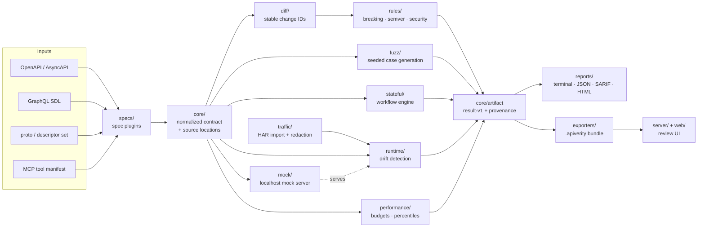

# api-verity-lab

<!-- badges -->
[](https://github.com/webdevsamran/api-verity-lab/actions/workflows/ci.yml)
[](https://github.com/webdevsamran/api-verity-lab/actions/workflows/codeql.yml)
[](https://github.com/webdevsamran/api-verity-lab/releases)
[](https://github.com/webdevsamran/api-verity-lab/blob/main/LICENSE)
[](pyproject.toml)
[](pyproject.toml)
<!-- /badges -->

**Unified API contract governance, breaking-change analysis, schema-driven
testing, runtime drift detection, traffic replay and performance regression
for OpenAPI, GraphQL and gRPC.**


<sub>Generated by `scripts/record_demo.py` from real runs against `fixtures/`,
and re-checked in CI — so it cannot go on showing output the code stopped
producing. The same session as an asciinema recording:
[`docs/demo.cast`](docs/demo.cast).</sub>

One modular, local-first platform that connects spec diffing, fuzzing,
drift detection, mocking and performance gates through **one data model,
one CLI, one result format, one plugin system and one frontend**.

> Original creator / founder / lead maintainer: **[@webdevsamran](https://github.com/webdevsamran)**
>
> ⚠️ Example/demo runs in this repository are clearly labeled synthetic data.
> The tool only ever sends traffic to base URLs you explicitly provide.

---

## The problem

Teams stitch together separate tools for spec diffing, contract testing,
fuzzing, drift detection, mocking and performance budgets. Each has its own
result format, its own CI wiring and its own mental model — so findings never
compose: you can't ask "which endpoints are both under-tested *and* drifting?"

api-verity-lab answers fifty-two questions from one place:

| Question | Command |
|---|---|
| We have no traffic recorded either | `apiverity capture --target URL --out traffic.har` |
| We have no contract at all — can you draft one? | `apiverity infer traffic.har -o draft.yaml` |
| We only have a Postman collection — is that enough? | `apiverity infer collection.json -o draft.yaml` |
| Is the contract we committed still what the app serves? | `apiverity app myapp:app --against openapi.yaml` |
| What changed between API versions? | `apiverity diff old.yaml new.yaml` |
| Is it breaking, risky or safe? | `apiverity breaking` |
| Whose build does it break? | `apiverity breaking --consumers consumers.yaml` |
| Which of a monorepo's forty contracts are failing, and whose are they? | `apiverity sweep . --base ../main` |
| Can each team get only its own contract health, weekly? | `apiverity digest sweep.json --since last-week.json` |
| Was semantic versioning respected? | `apiverity breaking --check-semver` |
| What version *should* this be? | `apiverity breaking --suggest-version` |
| Can I paste this into a PR description? | `apiverity breaking --summary` |
| Is it safe on the wire and breaking in every generated client? | `apiverity breaking --sdk` |
| What does this rule mean and how do I change it? | `apiverity explain BRK-RESP-FIELD-REMOVED` |
| Can we enforce our own house rules without forking? | `apiverity validate --policy-file house.yaml` |
| What would moving our Spectral ruleset cost? | `apiverity import-rules .spectral.yaml` |
| Can it re-run itself while I edit the spec? | `apiverity watch -- breaking old.yaml new.yaml` |
| Can my editor show these rules as I type? | `apiverity lsp` ([any LSP client](docs/lsp.md)) |
| Does the running API match its contract? | `apiverity drift --base-url` |
| How often did real traffic disagree with it? | `apiverity drift --corpus traffic.har` |
| Is a route we deleted still answering? | `apiverity ghosts spec.yaml --was v1.yaml --base-url` |
| Will anyone notice when staging starts drifting at 3am? | `apiverity monitor --state s.json -- drift ...` |
| Does an MCP server still serve the tools it declared? | `apiverity drift tools.json --base-url` |
| Is a tool description instructing my agent rather than describing itself? | `apiverity validate tools.mcp.json` |
| Will that MCP server hand its whole tool list to a stranger? | `apiverity drift tools.json --base-url` |
| Did an agent's tool surface change without anyone reviewing it? | `apiverity mcp-lock check --base-url` |
| Which MCP servers is this machine even configured to reach? | `apiverity mcp-inventory --include-home` |
| Is an agent calling something more often than anyone agreed to? | `apiverity budget calls.json --budget budgets.yaml` |
| Can I hand an auditor a dated, checksummed record of all of it? | `apiverity evidence run-*.json -o evidence/` |
| Can somebody else verify the audit log without trusting my server? | `apiverity audit export --db server.db --org-id 1` |
| Something is wrong — how do I stop releases right now? | `apiverity freeze on --reason ...` |
| Can an agent ask *this* whether its change is breaking? | `apiverity-mcp --root .` |
| Can a benchmark measure whether agents use our tool surface correctly? | `apiverity agent-tasks tools.json -o packs/` |
| How do the agents in my repo learn this tool exists? | `apiverity agent-setup --write` |
| Can schema-derived edge cases break it? | `apiverity test` |
| Could a fuzz run post a secret out of our own spec? | `apiverity test` (`GUARD-PAYLOAD-*`) |
| Does an update actually persist, and is a delete actually a delete? | `apiverity test --model-based` |
| Can one tenant read another tenant's data? | `apiverity test --authz --auth-profile alice --as bob` |
| Whose servers does our contract pull schemas from? | `apiverity validate openapi.yaml` (`SEC-DEP-*`) |
| If I edit this shared schema, whose build goes red? | `apiverity graph . --dependents-of shared/money.yaml` |
| Does this subgraph change break the supergraph? | `apiverity federation --subgraph a.graphql --against b.graphql` |
| Do multi-step workflows fail? | `apiverity workflow run` |
| Can I run the whole stack of mocks reproducibly? | `apiverity mock --workspace stack.yaml` |
| Is our workflow file portable, or locked to this tool? | `apiverity workflow wf.yaml --to-arazzo --spec openapi.yaml` |
| Can sanitized traffic be replayed safely? | `apiverity replay` |
| How do I check an API that needs a token? | `--auth-profiles profiles.yaml --auth-profile staging` |
| Did latency/error rate regress? | `apiverity regression` |
| Which endpoints lack coverage? | `apiverity coverage` |
| Can CI block breaking changes before release? | [GitHub Action](action.yml) (included) |
| Was this result bundle tampered with? | `apiverity verify bundle/` |
| Is a provider version safe to deploy? | `apiverity` server `/v1/can-i-deploy` |
| Who executes jobs inside our private network? | Workers pull via `POST /v1/jobs/claim` |

## How this compares

The API tooling landscape is crowded and largely healthy.

<!-- generated:readme-comparison -->
**14 competing projects are tracked**, with license, stars, last push and latest release fetched from the GitHub API on 2026-09-09 and committed to [`data/competitor-meta.json`](data/competitor-meta.json).

Across the 25 capability areas in [`data/competitive-capabilities.json`](data/competitive-capabilities.json), the deepest specialists cover a handful each:

| Tool | Capability areas covered |
|---|---|
| Pact (OSS) | 9 of 25 |
| Buf | 5 of 25 |
| Karate | 5 of 25 |
| Schemathesis | 5 of 25 |
| WireMock | 5 of 25 |
| Hoverfly | 4 of 25 |

That is the shape of the market, not a scoreboard: each of those tools is excellent inside its lane, and the classification behind the numbers is this project's own -- every cell carries its evidence note in the matrix. What none of them does is put diffing, schema-driven testing, runtime drift and performance budgets behind *one* contract model and *one* result format.

Archived, and worth knowing about: **Dredd**, **Optic**.

Full analysis, with every row's evidence: [docs/competitive-analysis.md](docs/competitive-analysis.md).
<!-- /generated:readme-comparison -->

Everything above this line comes out of the two committed data files, rendered by
[`scripts/generate_competitive_table.py`](scripts/generate_competitive_table.py); CI
fails when the document and the data disagree. What it does **not** claim is freshness —
the date is when the evidence was gathered, and only a refresh run moves it.

The judgement, which is not in any data file: **oasdiff** is the healthy incumbent for
spec diffing and is worth using if diffing is all you need. **Schemathesis** is the
reference for property-based API testing. **Spectral** owns rule-catalog linting. Match
their depth where it matters; do not pretend to have replaced them.

## Install

```bash
# macOS, Linux, WSL
curl -fsSL https://raw.githubusercontent.com/webdevsamran/api-verity-lab/main/install.sh | sh
```

```powershell
# Windows
irm https://raw.githubusercontent.com/webdevsamran/api-verity-lab/main/install.ps1 | iex
```

Either one finds a Python 3.11+, downloads the latest release's wheel, checks it
against the checksum GitHub reports for it, and installs with `uv`, `pipx` or
`pip` — whichever is there. `--dry-run` resolves and verifies without installing.

Not on PyPI yet, so `pip install api-verity-lab` does **not** work; publishing is
wired and waits on a Trusted Publisher only the account owner can register.
[docs/install.md](docs/install.md) has every channel, what each one needs, and
what to run if you would rather not pipe a URL into a shell.

## 60-second quickstart

```bash

# 0. Point it at your project. Detects your contracts, writes .apiverity.yaml,
#    and starts with the gate OFF -- a check that fails on its first run against
#    an API with history gets removed rather than adopted.
apiverity init
apiverity config validate

# 1. Validate a contract
apiverity validate fixtures/apis/crud/openapi.yaml

# 2. Diff two versions and detect breaking changes
apiverity diff fixtures/apis/versioned/v1.yaml fixtures/apis/versioned/v2.yaml --json
apiverity breaking fixtures/apis/versioned/v1.yaml fixtures/apis/versioned/v2.yaml

# 3. Enforce semver policy
apiverity breaking fixtures/apis/versioned/v1.yaml fixtures/apis/versioned/v2.yaml \
    --old-version 1.2.0 --new-version 1.3.0 --check-semver

# 4. Spin up the deterministic mock and test against it
apiverity mock fixtures/apis/crud/openapi.yaml --port 8090 &
apiverity test fixtures/apis/crud/openapi.yaml --base-url http://127.0.0.1:8090

# 5. Run an authored workflow (create → get → update → delete)
apiverity workflow run fixtures/workflows/crud-lifecycle.yaml

# 6. Detect runtime drift
apiverity drift fixtures/apis/drift/openapi.yaml --base-url http://127.0.0.1:8090

# 7. Gate performance
apiverity baseline fixtures/apis/crud/openapi.yaml --base-url http://127.0.0.1:8090 -o baseline.json
apiverity regression fixtures/apis/crud/openapi.yaml --base-url http://127.0.0.1:8090 \
    --baseline baseline.json --policy "GET /users p95 <= 250ms"
```

Every command emits structured output (`--json`, or `--format` on `report`), stable exit codes (`0` ok, `1` findings at/above
threshold, `2` usage error, `3` target unreachable, `4` internal error).

## A diff example

<!-- capture:diff -->
```console
$ apiverity diff v1.yaml v2.yaml
tool: apiverity
command: diff
old_version: 1.2.0
new_version: 2.0.0
changes:
  [meta] CHG-OPERATION_REMOVED-92658ed2-1  operation 'DELETE /users/{id}' was removed
  [request] CHG-PARAMETER_REQUIREDNESS-ca0e1629-1  parameter 'limit' (query) requiredness changed False -> True
  [request] CHG-PARAMETER_CONSTRAINT_CHANGED-ca0e1629-1  request parameter 'limit': constraint 'minimum' changed 1 -> 10
  [request] CHG-PARAMETER_CONSTRAINT_CHANGED-ca0e1629-2  request parameter 'limit': constraint 'maximum' changed 100 -> 50
  [response] CHG-ENUM_CHANGED-ca0e1629-1  response 200 body (application/json)[].role: enum changed (removed ['guest'], added [])
  [response] CHG-ENUM_CHANGED-e870987d-1  response 200 body (application/json).role: enum changed (removed ['guest'], added [])
  [request] CHG-ENUM_CHANGED-f73482dc-1  request body (application/json).role: enum changed (removed ['guest'], added [])
  [request] CHG-REQUEST_SCHEMA_CHANGED-f73482dc-1  request body requiredness changed False -> True
  [meta] CHG-DESCRIPTION_CHANGED-5eaae590-1  contract version changed '1.2.0' -> '2.0.0'
# ...followed by the provenance footer every artifact carries
```
<!-- /capture:diff -->

## A breaking rule (direction-aware)

Removing a field from a **response** breaks consumers; adding an optional
field to a **request** does not:

```yaml
# BRK-RESP-FIELD-REMOVED (ERROR)
GET /users/{id}:
  responses:
    "200":
      # v1 had: id, name, email   →   v2 has: id, name
      email: removed   # ← ERROR: clients reading .email will break
```

The catalog ships 74 rules across ERROR/WARN/INFO with per-rule severity
overrides — see [`docs/rule-catalog.md`](docs/rule-catalog.md), run `apiverity rules`,
or ask about one directly: `apiverity explain BRK-RESP-FIELD-REMOVED` prints what it
means, which group it belongs to, and the exact `--severity-override` to change it.
A rule nobody understands gets suppressed rather than fixed.

<!-- capture:breaking -->
```console
$ apiverity breaking v1.yaml v2.yaml
tool: apiverity
command: breaking
findings:
  [ERROR] BRK-OP-REMOVED  operation 'DELETE /users/{id}' was removed
  [ERROR] BRK-PARAM-REQUIRED  parameter 'limit' (query) requiredness changed False -> True
  [ERROR] BRK-CONSTRAINT-TIGHTENED  request parameter 'limit': constraint 'minimum' changed 1 -> 10
  [ERROR] BRK-CONSTRAINT-TIGHTENED  request parameter 'limit': constraint 'maximum' changed 100 -> 50
  [WARN] BRK-ENUM-NARROWED-RESPONSE  response 200 body (application/json)[].role: enum changed (removed ['guest'], added [])
  [WARN] BRK-ENUM-NARROWED-RESPONSE  response 200 body (application/json).role: enum changed (removed ['guest'], added [])
  [ERROR] BRK-ENUM-NARROWED-REQUEST  request body (application/json).role: enum changed (removed ['guest'], added [])
  [ERROR] BRK-REQ-BODY-REQUIRED  request body requiredness changed False -> True
# ...followed by the provenance footer every artifact carries
```
<!-- /capture:breaking -->

## A generated failure

Schema-driven tests derive edge cases from your constraints and minimize
failures to small reproductions:

```jsonc
// apiverity test --json (excerpt)
{
  "case": "POST /users negative: age violates exclusiveMinimum(0)",
  "request": { "method": "POST", "path": "/users", "body": {"name": "a", "age": -1} },
  "expected": "4XX",
  "actual": { "status": 500 },
  "finding": "server returned 5xx for invalid input",
  "reproduction": "curl -X POST http://127.0.0.1:8090/users -d '{\"name\":\"a\",\"age\":-1}'"
}
```

## Workflows

Stateful sequences are authored explicitly (never auto-generated destructively):

```yaml
# fixtures/workflows/crud-lifecycle.yaml
name: crud-lifecycle
allowed_hosts: ["http://127.0.0.1"]
steps:
  - name: create
    request: { method: POST, path: /users, body: {"name": "alice"} }
    extract: { user_id: "$.id" }
    assert: { status: 201 }
  - name: get
    request: { method: GET, path: "/users/{user_id}" }
    assert: { status: 200, jsonpath: { "$.name": "alice" } }
  - name: delete
    request: { method: DELETE, path: "/users/{user_id}" }
    assert: { status: [200, 204] }
cleanup:
  - request: { method: DELETE, path: "/users/{user_id}" }
```

## Drift

Compare what the API actually returns against what it declared:

<!-- capture:drift -->
```console
$ apiverity drift openapi.yaml --base-url http://localhost:8080
tool: apiverity
command: drift
findings:
  [WARN] DRIFT-STATUS  returned status 404 which is not declared (declared: ['200'])
  [WARN] DRIFT-MISSING-FIELD  $: missing required field 'email'
  [WARN] DRIFT-UNDECLARED-FIELD  $: undeclared field(s) ['age', 'role']
  [WARN] DRIFT-HEADER  declared response header 'X-Request-Id' missing
# ...followed by the provenance footer every artifact carries
```
<!-- /capture:drift -->

## Performance budgets

```bash
apiverity baseline ... -o perf-baseline.json
apiverity regression ... --baseline perf-baseline.json \
    --policy "GET /users p95 <= 250ms" --policy "POST /users error_rate <= 1%" \
    --policy "GET /users bytes_p95 <= 256KB"
```

A budget answers "is it fast enough". A **load shape** answers "at what rate
does it stop being":

```bash
apiverity regression openapi.yaml --base-url https://staging.example.com     --shape 'ramp:60s@1..20' --operation 'GET /users'
```

`constant`, `ramp`, `spike` and `soak`, each optionally with `+poisson`
arrivals, driven **open loop** -- a request goes out when it is due, whether or
not earlier ones came back, which is the only way to see a queue build. The run
reports how far behind its own schedule the generator fell, because a p99 from
a generator that could not keep up describes a load nobody asked for. See
[docs/load-shapes.md](docs/load-shapes.md).

Stable exit codes make this a CI gate; bundles record p50/p90/p95/p99,
throughput, timeouts, error rates and **response size** — percentiles rather
than a mean, because the response that hurts is the largest one a client hit.
Size units in a budget are decimal (`KB` is 1,000), which is what somebody
typing `256KB` means, and sizes are counted after decoding: that is the number
a payload budget is about, and it is larger than what crossed the wire.

Each report also carries one **cold connection probe** — DNS, TCP, TLS and what
the handshake negotiated — taken before the run and reported *beside* the
percentiles rather than inside them. The run pools connections, so the
handshake is paid once; amortising it into a p95 would describe a service
nobody is running.

## Architecture & plugins

Every supported spec format compiles into one normalized contract model, and
every engine downstream reads that model rather than the original document.
That is what lets a breaking-change rule, a fuzz generator and a drift check
agree about what an operation is. Boxes below are real packages under
[`apiverity/`](apiverity):

<!-- mermaid:architecture -->

<!-- /mermaid:architecture -->

See [ARCHITECTURE.md](ARCHITECTURE.md). Six versioned plugin entry points:

```
apiverity.specs · apiverity.rules · apiverity.checks
apiverity.generators · apiverity.exporters · apiverity.transports
```

Spec support matrix: OpenAPI 3.0/3.1/**3.2** ✅ full, including 3.2's `query`
method, `additionalOperations`, `querystring` parameters, hierarchical tags and
the OAuth device flow · AsyncAPI 2.x/3.x ✅ channels,
messages and direction-aware diffing · GraphQL SDL ✅ operation testing,
persisted operations and introspection drift ·
gRPC proto + compiled descriptor sets ✅ streaming, presence, reserved ranges ·
**MCP tool manifests** ✅ a saved `tools/list` diffed under the same rules,
plus a `BRK-MCP-*` family for the parts that are MCP's alone — annotation
hints, `outputSchema` presence and tool-description edits ·
**WSDL 1.1 / SOAP** ✅ portTypes, bindings and the XSD subset a WSDL actually
uses, plus a `BRK-SOAP-*` family for SOAPAction, binding style and SOAP
version — the three facts that break every generated stub while leaving every
message schema identical.

That last one is the shared model paying off rather than a new engine: a
removed tool, a newly-required argument and a narrowed enum in a manifest fire
the same `BRK-RPC-REMOVED`, `BRK-PARAM-ADDED-REQUIRED` and
`BRK-ENUM-NARROWED-REQUEST` rules as an OpenAPI change, and land in the same
`result-v1` artifact. Note that MCP defines no breaking-change semantics for a
tool manifest, so [that taxonomy](docs/rule-catalog.md) is this project's own
and says so.

## Frontend

A React + TypeScript app under [`web/`](web/) renders real generated fixture
data: side-by-side diff review, breaking-change cards, endpoint tree, drift
tables, latency charts, coverage charts, shareable filters and downloadable
reports. Serve results locally with `apiverity serve <bundle>`.

## Development

```bash
pip install -e ".[dev]"
pre-commit install
pytest && cd web && npm install && npm run build
```

See [CONTRIBUTING.md](CONTRIBUTING.md), [SECURITY.md](SECURITY.md),
[ROADMAP.md](ROADMAP.md) and [docs/](docs/).

<!-- related-projects -->
## Documentation

Browsable at **<https://webdevsamran.github.io/api-verity-lab/>**, or as files here:

| Document | What it covers |
|---|---|
| [ARCHITECTURE.md](ARCHITECTURE.md) | The normalized contract model every engine reads, and how change ids are built |
| [docs/rule-catalog.md](docs/rule-catalog.md) | Every breaking-change rule, generated from the code by `scripts/generate_rule_catalog.py` |
| [docs/spec-support.md](docs/spec-support.md) | What is supported per format: OpenAPI, AsyncAPI, GraphQL, gRPC, MCP, WSDL |
| [PROTOCOL_SUPPORT.md](PROTOCOL_SUPPORT.md) | Per-protocol status, graded EXISTING / PARTIAL / BLOCKED |
| [docs/capability-status.md](docs/capability-status.md) | Honest per-capability status, same grading |
| [docs/workflow-authoring.md](docs/workflow-authoring.md) · [docs/arazzo.md](docs/arazzo.md) | Writing stateful workflow manifests, and reading and writing them as Arazzo 1.1.0 |
| [docs/sdk.md](docs/sdk.md) · [docs/self-hosting.md](docs/self-hosting.md) | Using the library directly; running the server |
| [docs/ci.md](docs/ci.md) | Wiring the contract gate into a pipeline |
| [docs/load-shapes.md](docs/load-shapes.md) · [docs/objectives.md](docs/objectives.md) | Driving one operation at a declared arrival rate; objectives a contract states |
| [docs/virtualization.md](docs/virtualization.md) | Serving several contracts together, under one seed |
| [docs/auth-profiles.md](docs/auth-profiles.md) | Authenticating a run without writing a credential down |
| [docs/authorization.md](docs/authorization.md) | BOLA and BFLA probes between two identities |
| [SAFETY_MODEL.md](SAFETY_MODEL.md) · [docs/privacy.md](docs/privacy.md) | What this tool will and will not do to a target |
| [docs/mcp-drift.md](docs/mcp-drift.md) · [docs/mcp-poisoning.md](docs/mcp-poisoning.md) · [docs/mcp-lock.md](docs/mcp-lock.md) · [docs/mcp-inventory.md](docs/mcp-inventory.md) · [docs/call-budgets.md](docs/call-budgets.md) · [docs/blast-radius.md](docs/blast-radius.md) · [docs/ghost-routes.md](docs/ghost-routes.md) · [docs/inferred-contracts.md](docs/inferred-contracts.md) · [docs/monorepo-sweep.md](docs/monorepo-sweep.md) · [docs/mcp-exposure.md](docs/mcp-exposure.md) | Governing MCP servers: drift against a live one, a tool description read as executable text, a reviewed baseline, and exposing this one to agents |
| [docs/compliance-mapping.md](docs/compliance-mapping.md) · [docs/evidence.md](docs/evidence.md) | Findings mapped onto the OWASP MCP, Agentic and API Top 10s, and packaged as dated evidence for SOC 2, ISO 42001, DORA and the EU AI Act -- including what neither can assess |
| [docs/llms.txt](docs/llms.txt) · [docs/capabilities.json](docs/capabilities.json) | What this tool is and what it can do, for a model and for a machine -- both generated from the code |
| [AGENTS.md](AGENTS.md) | Constraints that are correctness rather than style, for anyone changing the code |

## Contributing

Issues and pull requests are welcome — see [CONTRIBUTING.md](CONTRIBUTING.md) for the
development setup and [AGENTS.md](AGENTS.md) for the rules that are not style preferences.

Two are worth stating here, because they are what most changes trip over:

- **Never assert what the run did not establish.** If a field cannot be derived it is
  `unknown`, with a reason. Fabricated provenance in a tool whose output gates other
  people's builds is the worst defect this project can ship.
- **Documented output is captured, never written.** README examples come from
  `scripts/capture_readme_examples.py`, the rule catalogue from
  `scripts/generate_rule_catalog.py`, and the competitive table from committed API data.
  Edit the generator, not the output; CI fails when they disagree.

Security issues go through [SECURITY.md](SECURITY.md), not a public issue.

## Related projects

Also by [@webdevsamran](https://github.com/webdevsamran):

- **[devrepro-doctor](https://github.com/webdevsamran/devrepro-doctor)** — "works on my machine", diagnosed. Read-only scans of developer machines and project toolchains, privacy-sanitized reproducibility snapshots, machine-to-machine diffs, and repair plans that never apply themselves above LOW risk.

- **[tooltrace-bench](https://github.com/webdevsamran/tooltrace-bench)** — vendor-neutral, reproducible benchmarking of AI agents on real tool-use tasks: coding, file operations, multi-step workflows and failure recovery, scored deterministically from traces rather than from the agent's own account of what it did.

- **[local-ai-hardware-bench](https://github.com/webdevsamran/local-ai-hardware-bench)** — vendor-neutral benchmarking of local AI runtimes across CPUs, GPUs, NPUs and edge accelerators. One loadgen drives every backend, and every published number carries the hardware, driver, runtime version, model checksum and seed that produced it.

These are independent projects: no shared library, no coupled releases, and each is usable on its own. What they do share is a rule — anything a README or a report claims has to be traceable to something the code actually produced, which is why each of them checks its own documentation in CI.

<!-- /related-projects -->

## License & citation

Apache-2.0 — see [LICENSE](LICENSE). Cite via [CITATION.cff](CITATION.cff).
Prior art that inspired the design is credited in ARCHITECTURE.md; no code
is copied from other projects.
