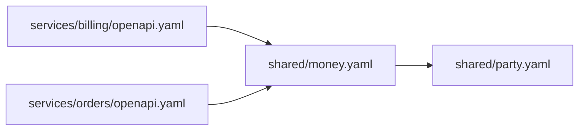

# Cross-repo spec dependency graph

```bash
apiverity graph .
apiverity graph . --dependents-of shared/money.yaml
apiverity graph . --mermaid --json
```

A monorepo with forty services has forty contract gates and no answer to the
question a platform team actually has: **if I edit `shared/money.yaml`, whose
build goes red?**

## Why the flat list cannot answer it

`Service.dependencies` records every location an entry document pulled, and not
one parent. Loading `fixtures/apis/multifile/openapi.yaml` gives:

```
['../shared/customer.yaml', './order.yaml', './schemas/error.yaml', './schemas/order.yaml']
```

`./order.yaml` is a reference made *by* `schemas/order.yaml`. Read as a child of
the entry document it names a file that does not exist, and
`../shared/customer.yaml` resolves one directory too high. Every transitive
dependency is drawn as a direct one, at a path that does not resolve.

`Service.dependency_edges` carries the file that made each reference, which is
what makes a graph possible at all:

```
openapi.yaml          -> ./schemas/order.yaml
schemas/order.yaml    -> ../shared/customer.yaml
schemas/order.yaml    -> ./order.yaml
openapi.yaml          -> ./schemas/error.yaml
```

## Blast radius

`--dependents-of` is the number the graph exists for. It is transitive, so a
schema no contract references *directly* still reports its dependents:

```json
{
  "node": "shared/party.yaml",
  "contracts": ["services/billing/openapi.yaml", "services/orders/openapi.yaml"],
  "known": true
}
```

`known` matters. A node nothing depends on and a node that is not in the tree
both produce an empty contract list, and they are different facts.

`shared` in the full output is every node more than one contract reaches, which
is the list of files nobody should edit casually.

## What it refuses to call an absence

Three things look identical in a naive graph and mean different things.

**A reference this run did not follow.** A remote `$ref` without
`--allow-remote-refs`, an absolute filesystem path, a file that would not read.
The edge is drawn and marked, with the reason, under `not_followed`. Dropping
it would make a contract look like it depends on *less* than it does, in the
report whose whole job is the opposite.

**A reference whose parent is unknown.** If a `$ref` is carried by a file the
builder never saw introduced, it has no place in the tree. It goes in
`unplaced`, not attached to the contract root — which is where a guess would
put it.

**A contract that will not load.** Its dependencies are unknown, so omitting it
would show every shared schema with fewer dependents than it has. Named under
`unreadable`, and the run exits `1`.

## Cycles

`a.yaml` references `b.yaml` references `a.yaml`. Or a file references itself,
which `fixtures/apis/multifile/schemas/order.yaml` does:

```json
"cycles": [["apis/multifile/schemas/order.yaml", "apis/multifile/schemas/order.yaml"]]
```

Each cycle is reported once however many ways there are into it, named by its
members rather than merely counted, and the walk is iterative — a self-
referential tree is exactly the input that would blow a recursive one's stack.

## Node kinds

| Kind | What it is |
|---|---|
| `contract` | a contract the walk found and loaded |
| `schema` | a file a contract or another schema references |
| `remote` | a URL |

`remote` is separate on purpose. A URL is not a file anybody in this repository
can edit, and a blast radius that counted the two together would answer the
wrong question. A node marked `outside` resolves above the tree that was walked
— legitimate in a monorepo, and nothing here knows whether it is governed.

## Diagram

`--mermaid` adds a diagram to the output. A dotted edge is one this run did not
follow.



Beyond 120 edges it truncates and says so in the diagram itself. One that
silently drew the first hundred would be read as the whole tree.

## Exit codes

| Code | Meaning |
|---|---|
| `0` | the graph was built, no cycles, every contract loaded |
| `1` | a cycle, or a contract that would not load |
| `2` | the path is not a directory, or holds no contracts |

An empty tree is a usage error, not an empty graph — the same refusal
[`sweep`](monorepo-sweep.md) makes, for the same reason.

## Relationship to the supply-chain rules

[`SEC-DEP-*`](supply-chain.md) judges one contract's references: remote,
unpinned, escaping its own tree. `graph` says who *else* is affected by each of
them. The same edges, asked a different question.
